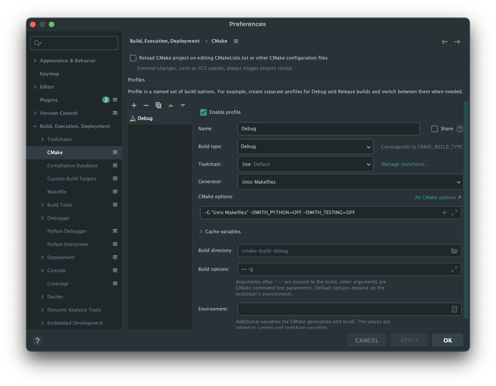
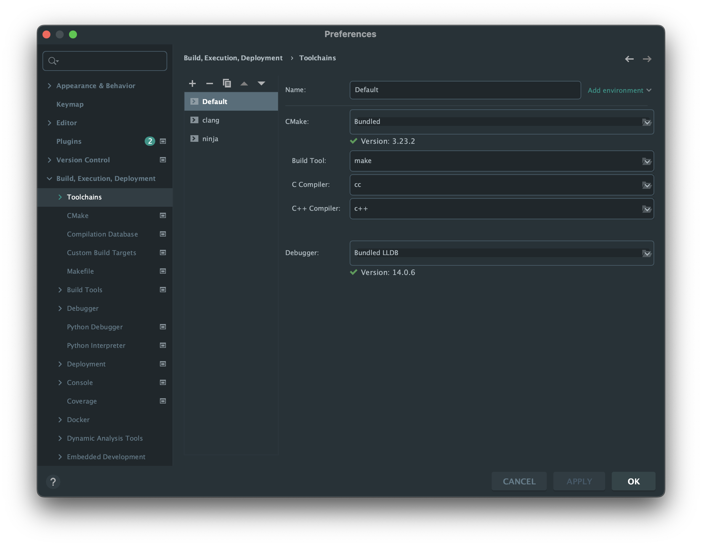
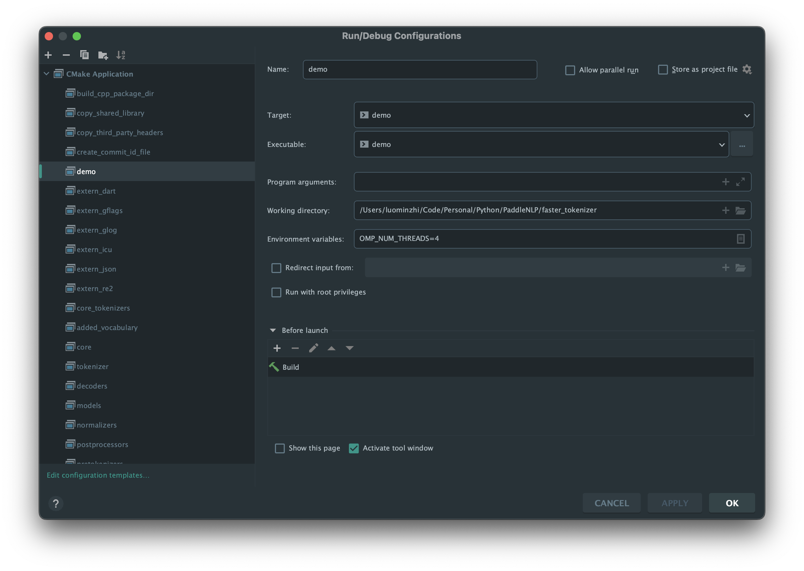

# 如何在 M1 Mac 上运行

## CMakeLists.txt 中新增生成 executable 可执行文件
```cmake
add_executable(demo demo.cpp)

target_link_libraries(
        demo
        PUBLIC
        core_tokenizers
)
```


## cmake 配置



## make build and run demo executable


